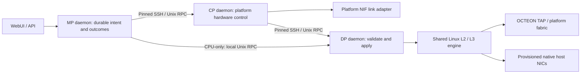

# Common MP / CP / DP control architecture

FFN-NGFW owns the management API, configuration definitions, control protocol,
transaction journal, and Linux network engine. Platform submodules own physical
device mappings, bring-up, capabilities and hardware-specific UI. No network
command, executable path, CPU assignment or PCI register address comes from an
HTTP caller.

## Responsibilities and current scope

* **MP:** authenticated administration, candidate XML, audit, runtime requests,
  durable submitted intent and returned configuration. The WebUI shows which
  nodes handled a request. Hardware-bearing hosts retain management CPU roles.
* **CP:** dispatches platform-owned resources locally and relays network requests
  to the DP. PA-5200 NIF activation uses the commissioned FE100 link service;
  CP physical link observations do not imply forwarding or policy readiness.
* **DP:** validates dependencies and revisions, serializes changes, journals the
  intent before execution, applies L2/L3 configuration, and returns the result.
  Runtime controller state is persisted for the existing boot replay mechanism.
* **CPU-only deployment:** MP and DP are separate daemons on one host; an extra
  CP process is optional. Native NICs must already be provisioned into the data
  namespace. Neither runtime apply nor autodetection moves a management NIC.

The shared engine implements disabled/L2/L3 interfaces, VLAN membership and
PVIDs, IPv4/IPv6 addresses, VRFs, static routes, ECMP and policy routing. These
match useful interface/routing concepts documented in Palo Alto's
[interface guide](https://docs.paloaltonetworks.com/ngfw/networking/configure-interfaces)
and [virtual router guide](https://docs.paloaltonetworks.com/ngfw/networking/configure-virtual-routers).
This is an FFN implementation, not a claim to reproduce proprietary internals.

## Protocol and recovery

Protocol v1 uses bounded newline-delimited JSON over root-only Unix sockets.
Remote hops invoke the fixed `ffn_planed.py call` client using pinned SSH host
keys and node-local credentials. The payload is passed on stdin; there is no
remote shell interpolation of configuration. Relays and daemons persist across
requests, while remote SSH subprocesses currently run per request. No new TCP
listener or unauthenticated management channel is introduced.

An envelope has exactly `v`, canonical UUID `id`, `resource`, `action`, and
object `payload`. Actions are status, validate, apply, lookup, result and resolve.
Apply/validate include the controller's current integer revision. Controllers
are allowlisted in root-administered node configuration. A CP may handle `nif`
locally while forwarding `network` to its DP.

Every apply stores its intent before dispatch. Repeating an identical UUID does
not blindly re-execute a leaf operation; changing the content of that UUID is
rejected. A leaf that crashes or loses its controller outcome retains an unknown
record and rejects new writes to that resource. Relays retain the original
request and can retry delivery of the same UUID, allowing the leaf to return its
durable result. Journals contain configuration and must remain root-only.

Read a result with `payload: {"request_id":"<original UUID>"}`. For an unknown
leaf outcome, inspect live configuration, repair any partial runtime changes,
and explicitly resolve using `payload: {"request_id":"<original UUID>",
"observed_revision":N}`. Resolve checks that revision again, records
**reconciled**, and never claims the interrupted operation succeeded or replays
it. A failed route/port rollback may need repair; revision equality alone is
not proof of healthy forwarding. Audit and request IDs provide the evidence
needed to follow that recovery.

## Installation and selection

Install Python 3 with sqlite3, iproute2 and the platform's kernel/network
dependencies on the participating nodes. Run
`image/install-plane-node.sh ROLE CONFIG.json` on each node from the core tree.
It installs code, the service template and role configuration; it does not start
services or change interfaces. Use platform-provided MP/CP/DP configurations,
or `config/planes/cpu-mp.json` and `cpu-dp.json` on a CPU-only host.

For a native backend, provisioning must create `ffn-data`, place and name its
owned interfaces `p1` through `p4096`, and supply `/etc/ffn/network.json` before
initializing the engine with `ffn_linux_network.py apply --backend native`.
This explicit initialization sets up the bridge, forwarding and configured
interfaces. Existing namespaces/bridges must not be adopted blindly. Runtime
patches cannot add unprovisioned native interfaces, and automatic native namespace
teardown is refused. Boot-time namespace provisioning and replay must be ordered
before the DP control service in the image's platform/host profile.

Start the DP, then CP if present, then MP daemons with `ffn-plane@ROLE.service`.
Set `FFN_PLANE_SOCKET=/run/ffn-plane-mp/control.sock` in the manager's local
systemd environment and restart the manager. The core Control Planes page then
appears. POST `/api/system/planes` is admin-only and accepts the protocol envelope.
Validate, review the returned proposal, then apply. The provider's existing
network WebUI also uses the MP daemon when this selection is present.

## Performance boundary and remaining work

Control messages never carry packets. Native Linux forwarding can use NIC queues
and kernel parallelism; the new daemons do not implement a packet worker scheduler
or tune RSS/IRQ/NUMA affinity. A high-core deployment should provision management
and dataplane CPU sets based on discovery, NIC NUMA locality and the selected
packet engine. No core-count or throughput gain is asserted by these changes.

The current PA-5200 physical packet path still uses the commissioned four-port
software relay through the MP. Moving traffic off the MP onto the direct hardware
path, validating all ports, hardware tables/queues, session offload and line-rate
inspection remain required to exploit the appliance fully. NIF service activation
alone does not complete those tasks. NIF disable is intentionally unsupported by
the current commissioned adapter.

Runtime network updates remain separate from XML commit. A future commit adapter
must compile the candidate into per-provider operations and coordinate rollback
across routing, NIF and security policy. This implementation provides per-resource
validation and recovery, not distributed two-phase commit. Legacy config agents
must not simultaneously own the same interfaces during migration.

## Verification

`test_planes.py` exercises three-plane and CPU-only paths, revision/UUID rejection,
lost replies, restart replay and explicit recovery. `test_plane_sockets.py` runs
real Unix sockets and subprocess relays with an inert backend. API and WebUI tests
cover permissions, validation and retention of the request ID after failures.
`test_linux_network.py` covers dependency checks and rollback. The opt-in root
`test_network_namespace.py` sends packets through disposable native veth interfaces
and removes only the namespaces it created; it never uses physical interfaces.
